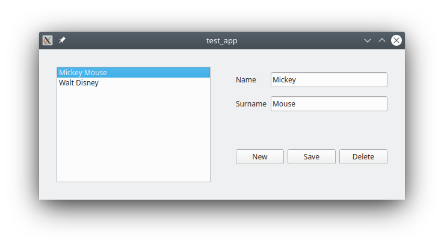

# A Roadtrip between Object Oriented and Functional Programming


*This road leads you to object-oriented enlightement*

Any guidelines out there to organize your object-oriented code in order to avoid the creation of a spaghetti codebase?

Functional Programming (FP) is the silver bullet for this.  But if we are forced to use Object-Oriented Programming (OOP), can we take features from FP and apply them to OOP?  

I am _not_ talking about copy-pasting FP features such as filters and maps into existing OOP languages, but something much more deeper.

In this post I will first provide a self-contained, short explanation of OOP's "global state mess" - the main reason for those hopeless codebases.

Then I do a compact intro into functional programming (FP) and discuss why there is no global state mess.

After that, the interesting bits start: I discuss parallels between OOP's object hierarchies and FP's function hierarchies.  This leads to a natural way to organize your OOP code: hierarchical objects with restricted communication within the hierarchies.

There are disparate practical applications for this.  I'll give a detailed example from the world of graphical user interfaces, implemented in PyQt.  The Vue.js framework is also discussed.

Let's start the trip.

## Global State Mess swamp

_(skip if you're way too familiar with this)_

The "global state mess" is an ubiquitous problem in modern programming.  You probably bang your head with it on a daily basis.  Even so, let's refresh our memory about it: 

Consider you create an object with some members: 
```
class Dummy:

    def __init__(self, i: int, j: int):
        self.i = i
        self.j = j

    def doSomething(self, par: int):
        self.i = self.j + par
    ...

obj1 = Dummy()
obj.doSomething(2)
```

Here the set of values of members `i` and `j` constitutes the _internal state_ of object `obj1`.  Here are some possible states, just to name a few:
```
i, j = 1,0
i, j = 1,1
i, j = 0,1
...
```
Method `doSomething` is a method that modifies the state of the object.

When you instantiate lots of objects in your program:
```
obj1 = Dummy()
obj2 = Dummy()
obj3 = SomeOtherClass()
...
```
The set of values of all members of all objects constitutes the _global state_ of your program.

Next, let's consider giving objects to objects:
```
obj2 = SomeClass(...)
obj1 = SomeOtherClass(.., obj2)
```
Here we give object (obj2) to another objects (obj1). Obj1 then modifies the internal state of obj2.  Obj2 can also be passed around to other objects.  

The so-called _global state mess_ is ready to be served.

If you ever been in a situation where you are wandering around a complex codebase, trying to find out what the different classes are actually _for_, while simultaneously trying to figure out how they affect each other and the global state of the program ("how did the program end up in this state?"), then you know what I'm talking about.

## Functional Programming village

In (purely) functional programming, you don't instantiate objects.  They don't exist.  There are no members either.  Everything revolves around functions.  For creating complex programming logic, instead of instantiating objects, passing them around and calling their members, you just do this:
```
func1(func2(func3(func4)))

[expression (1)]
```
i.e. a function calling a function, calling a function, etc.

And the state.  Where is it?

Sure, a function may have a short-lived intermediate state while its executing (imagine it doing maybe a few loops, some logic and waiting for other functions to return), but once it returns its value, it disappears from the call stack and that intermediate state says "puff!" - disappearing forever into the ether.

If you're able to frame your program in terms of functional programming, then congratulations, you have achieved the holy grail of programming: stateless code that is easily debugged, with perfect "separation of concerns" between different parts of the code: each function in the call chain just does "it's stuff", nothing else.  No global state to create a mess with.

In order to visualize this, let's create another presentation/description of expression (1).

Describing almost _anything_ with a [hierarchical list](https://www.wired.com/story/adam-savage-lists-more-lists-power-checkboxes/) is always a good idea, so we'll do just that: expression (1) can be written down as a hierarchical list like this:
```
func1
    func2
        func3
            func4

[diagram (2)]
```
which should be self-explanatory.

Lets add therein the inputs and return values of each function using this notation:
```
IN = function's input parameter(s)
UP = function's return value(s) - as it goes UP in the hierarchy
```

Resulting in:
```
func1
    func2
        IN: int i
        UP: int j
        func3
            IN: int c, d
            UP: str w
            func4
                IN: int e
                UP: list

[diagram (3)]
```
i.e., func2 takes as an input value, int i, returns int j, etc.

A certain function, can of course, use several functions lower in the hierarchy, resulting in trees/cascades like this:
```
func1
    func2
        func3
            func4
    func2b
        func3b
            func4b
        func3c
            func4c
                func5c

[diagram (4)]
```
i.e. `func1` calls both functions `func2` and `func2b`, etc.

We can think those functions as "intercommunicating entities".  But their "intercommunication" is strictly restricted, since they're just functions, and a function just takes an input value and spits out a return value:

- Going down in the tree, a "parent" function can only "communicate" (i.e. perform a function call with an input) with it's immediate "child" functions
- Going up in the three, a child can only communicate with it's immediate parent (i.e. by simply returning a result)
- Data that goes from parent to child is immutable (i.e. "one time copy")
- Data returned back to parent is similarly an immutable copy

There is no intercommunication in this tree that would a traverse between siblings, jump to ancestors (other than immediate parent), etc.  Those restrictions arise naturally, since in functional programming you can only use functions.

## Object Oriented valley

Next, let's leave the (fantasy) world of functional programming behind.  Let's turn that function cascade diagram (4) into an object instance hierarchy instead:
```
obj1
    obj2
        obj3
            obj4
    obj2b
        obj3b
            obj4b
        obj3c
            obj4c
                obj5c

[diagram (5)]
```
Where each `objN` is an object _instance_ (please do _not_ confuse this with an iheritance diagram), i.e. `obj1` instantiates and owns `obj2`, `obj3` instantiates and owns `obj4`, etc.

This is an archetypical pattern in OOP: you have a "master object" (obj1) which, during it's lifetime, instantiates various other objects (from several different classes).  These other objects then perform various tasks and return results higher up.

As you can see, it looks exactly the same as the functional programming diagram (4): **we do have a common denominator here**

Many OOP projects start in this exact (and clean) way, but it doesn't take long until antipatterns start to emerge.

Let's consider just one of those antipatterns:

"Master object" obj1 passes itself as a reference to obj2, which passes it to obj3, which passes it to obj4, etc.  These deeper level child objects then use setters and getters of the master object obj1 to get information from it and to change obj1's internal state.  

**An intractable global state mess is ready.**

This antipattern emerges for several reasons: it can be pressure from upper-level management to "get things done in an 'agile' way".  Say, obj4 needs some data from obj1 and the easiest way out is just to pass obj1 as a reference down the chain.  Future programmers just follow the flow, and anyway, once things are done this way, there is no going back anymore.

It could also be that "smart" junior programmer that was given the task to fix obj4 so that it receives data from other parts of the hierarchy tree.

Eventually, the code becomes an impenetrable spaghetti.  In the worst case scenario, to change even the simplest behaviour of the code will require weeks of work as you're desperately trying to find the response to the question: "in wtf-state the code is?".  This process might also involve red-faced and raving managers (who created the problem themselves in the first place, by wanting to be 'agile').

## In between

So, how to avoid the OOP disaster ever happening?

"Just use functional programming!" would be the advise from the functional-programming zealots, and they're right.

As explained above, functional programming language would have never allowed such behaviour, since it restricts the intercommunication in the tree structures of diagrams (4) and (5) by construction.

We can see that FP's power is *as much about state elimination, as it is about well-defined hierarchies having restricted communication.*

Keeping that in mind, let's remember that your code cannot always be staged in terms of pure functional programming.  Maybe it doesn't apply to your problem.  The libraries you are using are not written in functional programming.  

Let's mimic the mechanics of FP in OOP and also come up with a fancy acronym: HIerarchical Minimally Interacting Objects (HIMO):

- There is a clearly defined object hierarchy
- Communication is done strictly between parent and child only (no cross-communication across the hierarchy tree in diagram (5))
- Data is passed preferably as immutable copies between parent and child
- Analyze your global state and how it is partitioned into the hierarchy
- Avoid persistent states when possible.  You should consider keeping the persistent states as high in the tree as possible (however, not always recommendable).

A purely functional programming language enforces several of these rules by definition.  In other languages we can try to follow them (of course, until that "smart" junior programmer comes along).

## Graphical User Interface city

A particularly tricky situation in terms of a global state is a graphical user interface (GUIs).  A GUI has _always_ a state, typically a very complex one.

Ultimately, the "state" of the GUI is inside the user's head as he/she sees the morass of buttons, forms and input fields in front of him/her.  And that user won't go "puff" into the ether, even if you wished so.

Forms, views, lists, menus, etc. are typically referred to as "widgets".  Each widget has a state (the current active element in a list, fields in a form, state of a checkbox, etc.), which then interacts with other widgets.

### Model and View

Let's still put all this in the concept of Model-View-Controller.

In Qt and modern JS frontend frameworks, instead of [MVC](https://en.wikipedia.org/wiki/Model%E2%80%93view%E2%80%93controller) or [MVVM](https://en.wikipedia.org/wiki/Model%E2%80%93view%E2%80%93viewmodel) it makes more sense simply to talk about the Model and the View (the [MV](https://doc.qt.io/qt-5/model-view-programming.html#the-model-view-architecture)
 model):

- **The View**: Buttons, checkboxes, fields and their interactive/live/"reactive" interactions.  Think of an interactive input field checker, for example.
- **The Model**: Handles communication with the data source.
- The View and The Model communicate.  In Qt with signals and slots. In Vue, this communication is defined by the Vue components.  
- Both in Qt and Vue.js, the user programs the view (as defined here), the model and the intercommunication between them.

And yes, we have a great opportunity to create a variety of global state messes here:

1. View state mess: state of the widgets becomes intractable by writing obscure widget interactions.  In Qt you can create this with signals and slots.  In Vue.js with your vue components.
2. Model state mess: the "traditional" global state mess we have discussed earlier.
3. View + Model state mess: State of the View and the Model become strongly coupled together.

We can use HIMO to narrow down the intercommunication within the View and between the Model and the View and mitigate (1-3).

## A Qt Example sideroad

Next we'll consider a small and a silly example case and provide the code for it in Python Qt (PySide2 flavor).  Implementing the same thing in Vue.js is left as an excercise.  :)

Here is the goal: on the left, a list of items, showing the complete name of a person.  On the right, a form appears.  With the form you can do basic CRUD operations on the person data.  When the database is empty, the form and the "save" and "delete" buttons are hidden:



To see how it _really_ works, I suggest that you try it.  First, download it from [here](https://github.com/elsampsa/medium/blob/main/hierarchy/example.py), and then do this:
```
pip3 install --user PySide2
python3 example.py
```

We could create a state mess here by letting the different objects (list, form, fields, buttons) to call each others directly and to pass the state (= which element is chosen in the list, what has been updated in the form, etc.) around directly (of course, in this simple example, you have to kinda try to mess it up).

How can we organize this trivial example as HIMO as possible?  

First of all, we need a hierarchy.

In Qt, one creates hierarchical constructions by default: widgets are placed and contained within other widgets, so it fits naturally our purposes (unfortunately, Qt does not enforce us to restrict the inter-object communication in any way).

In our example, we have lots of QWidget objects contained in other QWidget objects in our object hierarchy.  The main ones to which we'll be applying HIMO, will have their names starting with letter "W".

This is going to be our hierachy:
```
WListForm                       master object: handles databases, updates other objects
    WList
        QListWidget
            QListWidgetItem(s)
    WForm
        QLineTextEdit
    WButtons
        QPushButton
        QPushButton
        ...
```

We have a hierarchy, so let's continue by restricting the intercommunication within that hierarchy:

- Going DOWN in the tree, call directly a setter method of a child (_could_ also be done with a Qt signal)
- Going UP in the tree, emit a Qt signal to the parent, or alternatively, offer a getter method

In Vue.js, you would do this:

- Going DOWN in the tree, modify child's "prop".
- Going UP in the tree, emit a signal to the parent (or use a getter).

Moreover:

- Variables that are passed between parent and child should be immutable copies

Our final object tree and its intercommunication looks like this:
```
WListForm:
    STATE:
        uuid   # current active record
        cache  # a dummy "database"

    WList
        IN:
            set_data(datums: list)
            set_uuid(uuid: str)
        UP:
            signals.uuid (str)

    WForm
        STATE:
            current active record (editable)
            visibility state of record fields
        IN: 
            set_data(datum: Datum)
            set_visible(viz: bool)
        UP: 
            get_data() -> dict
    
    WButtons
        STATE:
            visibility state of buttons "save", "delete"
        IN: 
            set_visible(viz: bool)
        UP: 
            signals.new
            signals.save
            signals.delete
```

Let's analyze this for a moment.  

First of all, we have added information about the state of each object.

For example, there is a state in the child object WForm, so it needs setters/getters accessible by the parent to manipulate that state.

WList's state includes a list of data records (datums) and the current chosen record.  However, as these are immediately communicated/synced with the parent WListForm object, we don't need to worry about them - it is as if there is no state in WList (the only state we care about is in the parent object).  In this case we have "moved" the state into a higher level object in the hierarchy (as discussed in "HIMO" above).

Some other things to note (also commented in the code itself):

- Setter functions do not trigger signals: you don't want `signals.uuid` emitted when calling `set_uuid`.  This is a good practice that avoids confusion.
- Namespaces are used to further organize things, in this case, signals are always in their own "sub-namespace".

That's it.  Thank you for hanging on.   The only thing to left to do in this artcile is to take a look at the code itself.  Hopefully you'll enjoy.  If not, please leave some rants into the comments.

## Back home

Thanks for joining us on this trip from functional to object-oriented programming, object hierarchies, graphical user interfaces and from there to Qt and Vue.js.

We saw how we can use the lessons from functional programming to make our object-oriented code more organized and transparent.  Namely, by defining hierarchies, restricting communication within those hierarchies and eliminating states if possible.

This was applied to a trivial graphical user interface example.  However, the same principle can be applied in disparate fields of programming.

Final tip: sketching the object hierarchies, their inputs and outputs, helps in developing/debugging your code.  So it's a good idea to include them into your code comments (like we did here).


